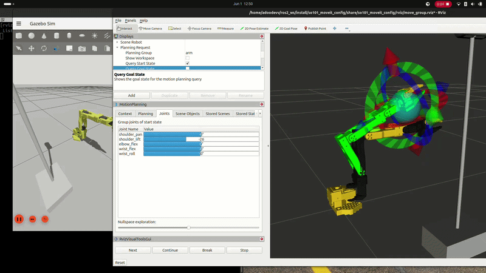

# so101_ros2


<p align="center">
  
</p>

ROS 2 stack for the [SO-101](https://github.com/TheRobotStudio/SO-ARM100) robot arm on **ROS 2 Jazzy**. Visualize the arm in RViz, run it in **Gazebo Harmonic**, and plan motions with **MoveIt 2**.

## What you can do

- **Visualize** the arm in RViz with interactive joint sliders (no simulation required)
- **Simulate** the arm in Gazebo with ros2_control arm and gripper controllers
- **Plan and execute** pick-and-place style motions in MoveIt 2 (OMPL, Pilz, STOMP)
- **Bridge** an optional Intel RealSense D435 camera from Gazebo into ROS 2

## Packages

| Package | Description |
|---------|-------------|
| [so101_ros2](so101_ros2/) | Meta-package that pulls in the full stack |
| [so101_description](so101_description/) | URDF/xacro, meshes, RViz config |
| [so101_moveit_config](so101_moveit_config/) | MoveIt 2 config, SRDF, planning pipelines, ros2_control controllers |
| [so101_gazebo](so101_gazebo/) | Gazebo Harmonic simulation and worlds |
| [so101_bringup](so101_bringup/) | Convenience launch scripts for Gazebo and MoveIt |
| [so101_system_tests](so101_system_tests/) | System test scripts (planned) |

## Status

- [x] Robot description (URDF/xacro, meshes)
- [x] RViz visualization
- [x] ros2_control integration (Gazebo)
- [x] Gazebo simulation with pick-and-place world
- [x] Arm and gripper control in simulation
- [x] MoveIt 2 motion planning (SRDF, move_group, OMPL / Pilz / STOMP)
- [ ] Hardware interface (real robot)
- [ ] System test scripts

## Prerequisites

- Ubuntu 24.04 (Noble)
- [ROS 2 Jazzy](https://docs.ros.org/en/jazzy/Installation.html)
- Gazebo Harmonic (`ros-jazzy-ros-gz`)
- ros2_control (`ros-jazzy-ros2-control`, `ros-jazzy-gz-ros2-control`, `ros-jazzy-ros2-controllers`)
- MoveIt 2 (`ros-jazzy-moveit`)

`rosdep` (see below) installs most dependencies from the package manifests.

## Build

```bash
cd ~/ros2_ws/src
git clone https://github.com/adoodevv/so101_ros2.git
cd ~/ros2_ws
rosdep install --from-paths src --ignore-src -r -y
colcon build --symlink-install
source install/setup.bash
```

## Quick start

Source the workspace in every new terminal:

```bash
source ~/ros2_ws/install/setup.bash
```

### 1. RViz only (no simulation)

Use this to inspect the robot model and move joints with sliders. No Gazebo or controllers needed.

```bash
ros2 launch so101_description robot_state_publisher.launch.py
```

In RViz, use the **Joint State Publisher** panel to drag joint sliders.

### 2. Gazebo simulation

Starts Gazebo with the pick-and-place world, spawns the robot, loads ros2_control controllers, and opens RViz.

```bash
ros2 launch so101_gazebo so101.gazebo.launch.py
```

Or use the convenience script (same stack, camera enabled):

```bash
bash $(ros2 pkg prefix so101_bringup)/share/so101_bringup/scripts/so101_gazebo_launch.sh
```

Wait until controllers are active before sending commands:

```bash
ros2 control list_controllers
```

You should see `joint_state_broadcaster`, `arm_controller`, and `gripper_controller` in the **active** state.

**Useful launch options:**

| Argument | Default | Description |
|----------|---------|-------------|
| `world_file` | `pick_and_place.world` | `empty.world` for a minimal scene |
| `use_rviz` | `true` | Start RViz |
| `use_camera` | `false` | Bridge D435 color/depth topics from Gazebo |
| `spawn_delay` | `2.0` | Seconds before spawning the robot |
| `controller_load_delay` | `5.0` | Seconds before loading controllers |

Example — empty world, no RViz:

```bash
ros2 launch so101_gazebo so101.gazebo.launch.py world_file:=empty.world use_rviz:=false
```

> **Note:** `pick_and_place.world` downloads models from [Gazebo Fuel](https://app.gazebosim.org) on first run. An internet connection is required once; models are cached locally afterward.

### 3. Gazebo + MoveIt 2 (recommended demo)

This is the full simulation demo: Gazebo for physics, MoveIt for motion planning, and RViz with the MoveIt MotionPlanning plugin.

**Option A — single launch file:**

```bash
ros2 launch so101_bringup so101_gazebo_moveit.launch.py
```

**Option B — convenience script** (starts Gazebo first, then MoveIt after controllers are up):

```bash
bash $(ros2 pkg prefix so101_bringup)/share/so101_bringup/scripts/so101_gazebo_and_moveit.sh
```

Give the stack ~15 seconds to start. In the MoveIt RViz window:

1. Under **Planning**, set **Planning Group** to `arm_with_gripper` (or `arm` / `gripper` separately).
2. Drag the interactive marker to set a goal pose, or use the **Joints** tab.
3. Click **Plan**, then **Execute**.

Predefined poses (`home`, `ready`, `open`, `closed`) are available under the **Select Goal State** dropdown when a group is selected.

## Control the arm manually

After Gazebo is running and controllers are active, you can send trajectories directly (without MoveIt):

**Move the arm:**

```bash
ros2 topic pub --once /arm_controller/joint_trajectory trajectory_msgs/msg/JointTrajectory "{
  joint_names: ['shoulder_pan', 'shoulder_lift', 'elbow_flex', 'wrist_flex', 'wrist_roll'],
  points: [{positions: [0.3, -0.8, 0.6, -0.3, 0.5], time_from_start: {sec: 3, nanosec: 0}}]
}"
```

**Open / close gripper** (range: -0.17 closed … 1.75 open):

```bash
ros2 topic pub --once /gripper_controller/commands std_msgs/msg/Float64MultiArray "{data: [1.5]}"
ros2 topic pub --once /gripper_controller/commands std_msgs/msg/Float64MultiArray "{data: [-0.17]}"
```

## Robot joints

| Joint | Type | Limit (rad) |
|-------|------|-------------|
| `shoulder_pan` | revolute | -1.92 … 1.92 |
| `shoulder_lift` | revolute | -1.75 … 1.75 |
| `elbow_flex` | revolute | -1.69 … 1.69 |
| `wrist_flex` | revolute | -1.66 … 1.66 |
| `wrist_roll` | revolute | -2.74 … 2.84 |
| `gripper` | revolute | -0.17 … 1.75 |

## Package documentation

For launch arguments, controller details, and world descriptions, see the per-package READMEs:

- [so101_description](so101_description/README.md)
- [so101_gazebo](so101_gazebo/README.md)
- [so101_moveit_config](so101_moveit_config/README.md)
- [so101_bringup](so101_bringup/README.md)

## Roadmap

description → simulation → planning → **hardware control**

Hardware drivers and automated system tests are the next milestones.
